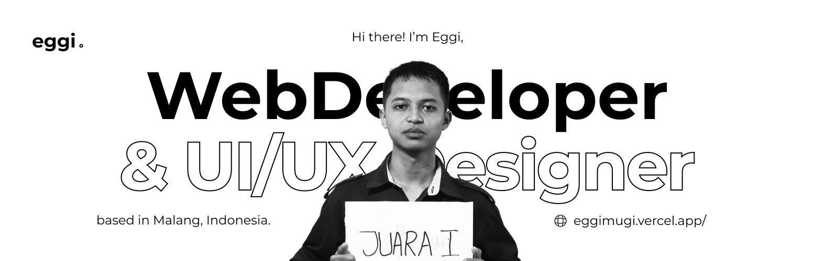

# Hi there 👋, I'm Eggi Mugi

💻 **Software Engineering Student | Backend & Frontend Enthusiast | UI/UX Designer**

---

## 🌟 About Me

- 🎓 Vocational High School student majoring in **Software Engineering (RPL)**
- 🔭 Currently learning **JavaScript, TypeScript, React.js, Node.js**
- 🎯 Future goals: **Software Engineer & Entrepreneur**
- 📚 I enjoy reading, listening to hip-hop musics and improving my English

---

## 🛠 Tech Stack & Tools

**Languages & Frameworks:**

 
 
 
 
 
 
 
 

**Databases & Tools:**

 
 
 

**Others:**  

---

## 🚀 Featured Projects

- 🎬 [CinemaDB](https://cinema-omdb.vercel.app/) – Movie search app using OMDb API
- 🌐 [Reog Ponorogo Website](https://reog-ponorogo.vercel.app/) – Simple landing page
- 🍰 [Bakery Backend](https://github.com/eggimugi/bakery) – Backend with CRUD features
- 💼 [Jobseeker Website](https://github.com/eggimugi/jobseeker) – Jobseeker website

---

## 📊 GitHub Stats

---

## 📫 Contact Me

- 📧 Email: eggimugi03@gmail.com
- 💼 LinkedIn: [eggimugi](https://www.linkedin.com/in/eggimugi/)
- 🌐 Portfolio: https://eggimugi.vercel.app/

---

## Let's play a game

<picture>
  <source media="(prefers-color-scheme: dark)" srcset="https://raw.githubusercontent.com/eggimugi/eggimugi/output/pacman-contribution-graph-dark.svg">
  <source media="(prefers-color-scheme: light)" srcset="https://raw.githubusercontent.com/eggimugi/eggimugi/output/pacman-contribution-graph.svg">
  
</picture>

---

⭐️ From [eggimugi](https://github.com/eggimugi)
